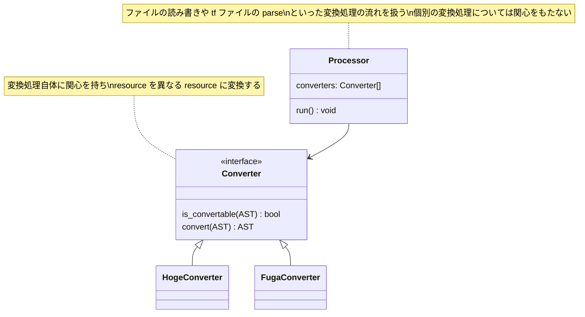

この記事は[スターフェスティバル Advent Calendar 2024](https://qiita.com/advent-calendar/2024/stafes) 1 日目の記事です。
今年もやっていくぞ！

https://qiita.com/advent-calendar/2024/stafes

---

こんにちは！[スターフェスティバル株式会社](https://stafes.co.jp/)でソフトウェアエンジニアをしている[吉田あひる](https://twitter.com/strtyuu)です！
弊社では [Snowflake](https://www.snowflake.com/ja/) を活用したデータ基盤の運用・構築をしており、 Snowflake 内のリソース管理には Terraform を活用しています。

[Snowflake の Terraform Provider](https://github.com/Snowflake-Labs/terraform-provider-snowflake/) はまだ experimental フェーズということもあり破壊的な変更も多々あるのですが、少し前に権限周りのリソース(grant)に対して大規模な再設計^[https://github.com/Snowflake-Labs/terraform-provider-snowflake/blob/44c0c37047ee15cd2856056270a1fb708473c4d6/docs/technical-documentation/grants_redesign_design_decisions.md]が行われました。（めでたいですね！）
その影響から弊社では 1000 件以上の deprecated が発生する形になってしまっていたので、本記事ではその対応について紹介したいと思います！

## どのような変更なのか？
不具合の多かった既存の23個のリソースが全て非推奨になり新しく追加された8個のリソースに集約されるという、かなり影響範囲の広い変更となりました。
非推奨となった既存のリソースは 2024/6/26 に削除されるというアナウンス^[https://github.com/Snowflake-Labs/terraform-provider-snowflake/discussions/2736]が公式にされているため、弊社でもこのタイミングで対応する運びとなりました。

## どのようなやり方で対応したのか？
既存リソースの削除にあたって公式から移行ガイド^[https://github.com/Snowflake-Labs/terraform-provider-snowflake/blob/efde48db07a9eb47c34a5febf1b4de6e4f0671f9/docs/technical-documentation/resource_migration.md]も出ていますが、作業コストが高そうなためこちらは見送り、非推奨のリソースを新しいリソースに自動で変換するスクリプトを自分たちで用意する方法をとることにしました。

### 要件など
もともとのリソースと新しいリソースでは思想が若干異なっている部分もあり、たとえば権限とロールが 1:n だったものが n:1 という逆の関係に変わっていたり、OWNERSHIPの権限もまとめて扱えていたものが別のリソースに分離されていたりなど、単純な置換ではなく多少よしなにした上で変換してあげる必要があります。

そのため、新しいリソースの思想に完全に合わせた変換を行うことも大変だったので以下のような方針で対応しました。

#### OWNERSHIP 以外の権限
```diff
- resource "snowflake_stage_grant" "hoge_usage" {
+ resource "snowflake_grant_privileges_to_account_role" "hoge_usage" {

- database_name = snowflake_database.db.name
- schema_name   = snowflake_schema.schema.name
- stage_name    = snowflake_stage.stage.name
+ on_schema_object {
　   # 元のリソースに合わせたタイプに
+   object_type = "STAGE"
+   object_name = "${snowflake_database.db.name}.${snowflake_schema.schema.name}.${snowflake_stage.stage.name}"
+ }

# 権限は配列に変換
- privilege     = "USAGE"
+ privileges    = ["USAGE"]

# 新しいリソースではロールは1つしか扱えないので for_each などで対応
- roles         = ["ROLE1", "ROLE2"]
+ for_each      = toset(["ROLE1", "ROLE2])
+ account_role_name = each.key
}
```

#### OWNERSHIP の権限
```diff
- resource "snowflake_stage_grant" "hoge_ownership" {
+ resource "snowflake_grant_ownership" "hoge_ownership" {
- roles     = ["ROLE1"]
- privilege = "OWNERSHIP"
　 # OWNERSHIP は1つのロールにしか割り当てられないので for_each は正しくないが、roles に変数を使っている場合などに先頭の要素だけを抜き出すのが大変だったのでそのまま置換するだけにした
+ for_each          = toset(["ROLE1"])
+ account_role_name = each.value

- database_name = snowflake_database.db.name
- schema_name   = snowflake_schema.schema.name
- stage_name    = snowflake_stage.stage.name
+ on {
    # 元のリソースに合わせたタイプに
+   object_type = "STAGE"
+   object_name = "${snowflake_database.db.name}.${snowflake_schema.schema.name}.${snowflake_stage.stage.name}"
+ }
+ outbound_privileges = "COPY"
}
```

#### その他
大枠の方針以外でもいくつか気を付けていた点を紹介します。

1つ目は完璧な変換は目指さないという点です。
完璧な変換を目指そうとすると、エッジケースに対応するための実装コストが大きくなってしまうため、9割程度のリソースが自動変換されればよく、残りは手動で対応する方がトータルの対応コストは低くなると判断しました。
そのため、対応できないパターンの自動変換がうっかり走らないように、その場合はしっかりと変換をスキップできるような処理も追加しました。

次に、一度に全ての変換は行わないようにしていました。
一度に全てに対応すると影響範囲も広く動作確認が大変になるため、1種類ずつなど徐々に対応範囲を広げていくことにしました。

最後に、変換処理に対してテストはしっかり書くようにしました。
テストがないと変換後の大量の修正差分に対して人力でコードレビューをしないといけない羽目になり、それは避けたかったため
変換処理のテストの内容に対してチーム内で合意をとり、自動変換されたコードに対しては斜め読み程度のレビューで良いことにしました。


### 設計方針

正規表現の置換などでの対応が難しい場合は AST などを使う必要があると思うので、今回は terraform(hcl) の AST を手にいれるために [hashicorp/hcl](https://github.com/hashicorp/hcl) を使ってみました。

また、リファクタリングツールではどのように変換するかといったところに可変性があると考えたので、様々な変換処理を統一的に扱えるような抽象化と変換のパターンを増やす際に影響範囲が小さくなるように設計しました。



かなり単純化した Processor の処理の流れは以下のようになってます。
```go
func (p *Processor) Run(filePath string) error {
    f := NewFile(filePath)
	// AST 解析
	ast, _ := hclwrite.ParseConfig(f.Content, f.Path, hcl.InitialPos)
	
	// ファイル内のブロックを走査
	for _, block := range ast.Body().Blocks() {
		for _, c := range p.converters {
			if c.IsConvertable(block) {
				// Converter に具体的な変換処理を移譲
				newBlock := c.Convert(block)
				// リソース名やブロックの中身を変更する
				block.SetType(newBlock.Type())
				block.SetLabels(newBlock.Labels())
				block.Body().Clear()
				block.Body().AppendUnstructuredTokens(newBlock.Body().BuildTokens(nil))
				break;
			}
		}
	}

	// tf ファイルの上書き
	f.Overwrite(ast.Bytes())

	return nil
}
```

このように、 Processor が具体的な変換処理に関心を持たないことで、Processor に持たせる Converter を追加していくだけで追加の要件に対応できる形になっています。


### テストの方針
変換処理をテストしたいと考えていますが、 AST に対して直接テストする形だとレビュワーにもわかりにくいため、 AST をテストするのではなく、変換後のファイルをテストする形にしました。

```go
func TestHogeConverter(t *testing.T) {
	p := Processor{
		converters: []Converter{&HogeConverter{}}
	}
	// 変換前のテスト用ファイルに対して変換処理を実行
	p.Run("hoge_converter.tf")
	// 想定している変換結果が記述されているファイルを読み込む
	file, _ := os.Open("hoge_converter_expected.tf")
	defer file.Close()
	expected, _ := io.ReadAll(file)

	// 実際の変換結果と想定している変換結果が一致するかテスト
	result := p.Output["hoge_converter.tf"]
	if diff := cmp.Diff(string(expected), result); diff != "" {
		t.Errorf("unexpected result (-want +got):\n%s", diff)
	}
}
```

その場合、テストの流れ自体は全ての Converter で共通化できるように思えたため、変換前と変換後のファイルを配置するためのディレクトリを作成し、そのディレクトリ内のファイルを自動で読み取り全てに対してテストを実行するような形にしました。

```go
func TestAll(t *testing.T) {
	fileNames := collectTestFileNames()
	for _, fileName := range fileNames {
		filepath := "testdata/" + fileName
		t.Run(fileName, func(t *testing.T) {
			p := NewProcessor(AllConverters())

			// 変換前のテスト用ファイルに対して変換処理を実行
			p.Run(filepath)
			// 想定している変換結果が記述されているファイルを読み込む
			file, _ := os.Open(strings.TrimSuffix(filepath, ".tf") + "_expected.tf")
			defer file.Close()
			expected, _ := io.ReadAll(file)

			// 実際の変換結果と想定している変換結果が一致するかテスト
			result := p.Output[fileName]
			if diff := cmp.Diff(string(expected), result); diff != "" {
				t.Errorf("unexpected result (-want +got):\n%s", diff)
			}
		})
	}
}
```

そうすることで、Converter を追加する際は以下のような変換前後の tf ファイルを用意するだけで良くなり、テストコードを書く必要がなくなったためテストも追加しやすくなりました。

```tf:database_grant.tf(テストの入力となる変換前のファイル)
resource "snowflake_database_grant" "test" {
  provider      = snowflake.security_admin
  database_name = snowflake_database.common_db.name
  privilege     = "USAGE"
  roles = [
    "ROLE1",
  ]
  with_grant_option = false
}
```

```tf:database_grant_expected.tf(想定している変換結果を示したファイル)
resource "snowflake_grant_privileges_to_account_role" "test" {
  for_each = toset([
    "ROLE1",
  ])
  provider          = snowflake.security_admin
  account_role_name = each.key
  privileges        = ["USAGE"]
  on_account_object {
    object_type = "DATABASE"
    object_name = "${snowflake_database.common_db.name}"
  }
  with_grant_option = false
}
```

## おわりに
リファクタリングツールの作成には2日ほどかかりましたが、その後の apply などは合計で1人日もかからずにおわり、手動で全て対応していた場合に比べてかなり時間を節約できたかなと思います。やったね！
というわけで、このようなリファクタリングツールを自作することで Snowflake Provider の大規模な後方互換性の破壊に対応してみた話でした。

スターフェスティバルではともに働く仲間を募集しております！カジュアル面談のご応募お待ちしております！
https://stafes.notion.site/stafes/d0996a00d77d418280982797c7e16001
